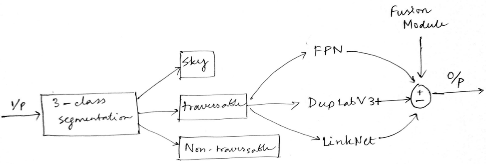
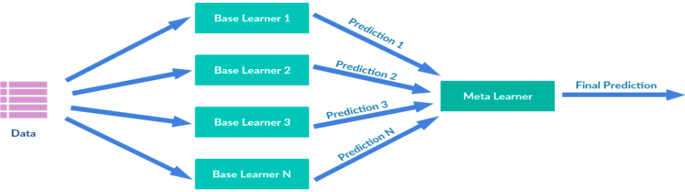
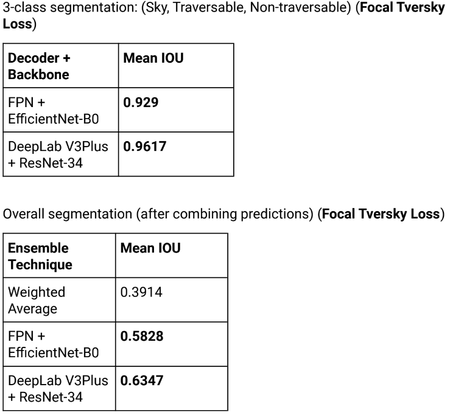
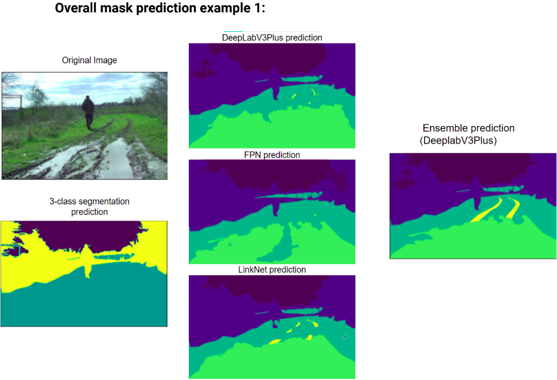
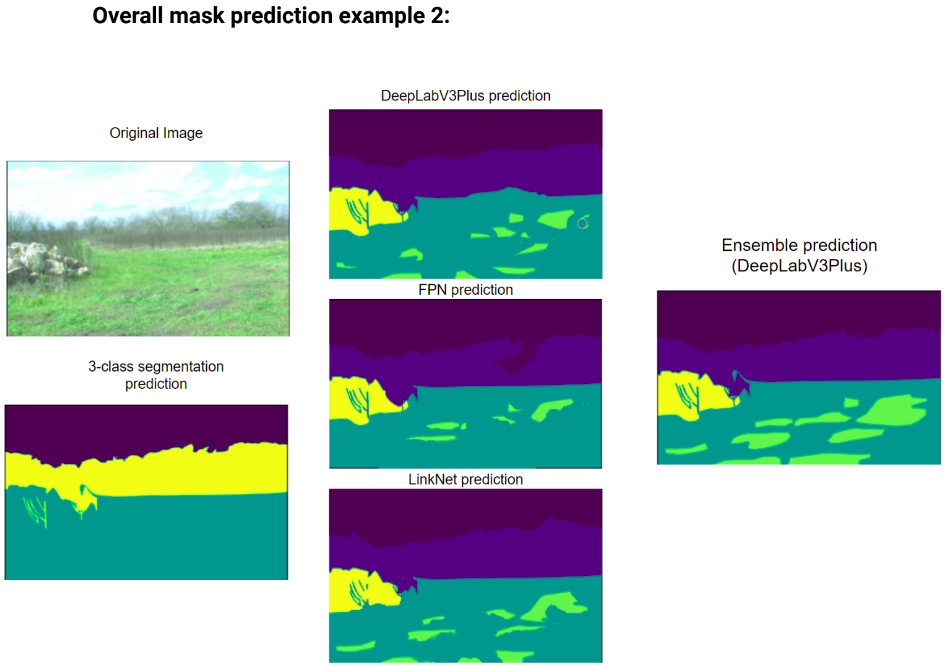

# Semantic Segmentation of a multi-modal dataset for Off-Road Robotics (RELLIS-3D)

- [Paper](https://arxiv.org/abs/2011.12954)

## Author
- [Ankur Guria](https://www.linkedin.com/in/ankurguria/)

#### [Detailed REPORT of out project](https://github.com/ankurguria/Semantic-Segmentation-Off-Road-Robotics-RELLIS-3D/blob/main/Project%20Report.pdf)

## Objective
   In this project, we have tried to perform semantic segmentation i.e. pixel-wise classification of a digital image to partition it into multiple segments, of a multimodal dataset collected in an off-road environment, RELLIS-3D, which contains annotations for 13,556 LiDAR scans and 6,235 images. We have used the images only. The data was collected on the Rellis Campus of Texas A&M University. It comprises 20 classes viz. sky, grass, tree, bush, concrete, mud, person, puddle, rubble, barrier, log, fence, vehicle, object, pole, water, asphalt, and building.
   Our objective is to design a lightweight (computationally less expensive) algorithm to solve the above problem to be able to get higher frames per second while running the algorithm in real-time.

#### [DATASET](https://github.com/unmannedlab/RELLIS-3D)
#### Code: Please send an email stating your purpose @ ankur17@iiserb.ac.in

## Approach schematic

## Experiment (best performance)
- We used **DeepLabV3Plus** and **FPN** for the 3-class segmentation.
- Trained **DeepLabV3Plus**, **FPN**, and **LinkNet** separately for the Traversable class segmentation.
- We experimented with **weighted averaging** and **stacking ensembling** techniques to combine the predictions of the sub-models.
- **DeepLabV3Plus** and **FPN**  were implemented as meta-learners in stacking.
- **Tversky loss**, **Focal Tversky loss**, and **Dice loss** functions were tried in both the 3-class segmentation, base learner, and meta-learner network of stacking ensembles. 

## Results

## Predictions

### References:
- Liang-Chieh Chen, Yukun Zhu, George Papandreou, Florian Schroff, and Hartwig Adam: Encoder-Decoder with Atrous Separable Convolution for Semantic Image Segmentation: arXiv: 1802.02611
- Abhishek Chaurasia, Eugenio Culurciello: LinkNet: Exploiting Encoder Representations for Efficient Semantic Segmentation: arXiv: 1707.03718
- Tsung-Yi Lin, Piotr Dollar, Ross Girshick, Kaiming He, Bharath Hariharan, and Serge Belongie: Feature Pyramid Networks for Object Detection: arXiv: 1612.03144
- Hengshuang Zhao, Jianping Shi, Xiaojuan Qi, Xiaogang Wang, Jiaya Jia: Pyramid Scene Parsing Network: arXiv: 1612.01105: Riyaz Sikora, O'la Hmoud Al-laymoun: A Modified Stacking Ensemble Machine Learning Algorithm Using Genetic Algorithms 

